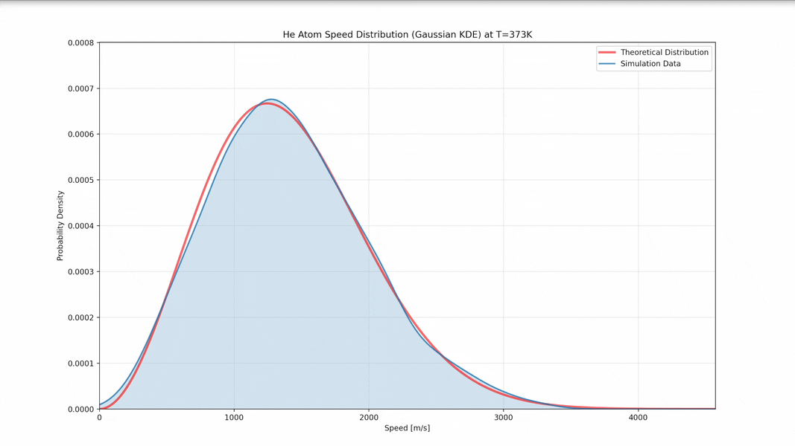

# Numerical Reconstruction of the Maxwell-Boltzmann Distribution via 3D Monatomic Hard-Sphere Simulation
This project explores the numerical reconstruction of the Maxwell-Boltzmann probability density function based on data generated from a 3D hard-sphere system. Additionally, the study evaluates the accuracy of reconstruction by comparing cubic spline interpolation and standard non-linear curve fitting (scipy.optimize) against the theoretical curve.
<table>
  <tr>
    <td width="40%" align="center" valign="middle">
      
    </td>
    <td width="20%" align="center" valign="middle">
      
    </td>
    <td width="40%" align="center" valign="middle">
      
    </td>
  </tr>
</table>
