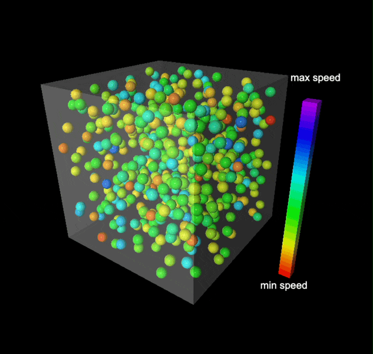
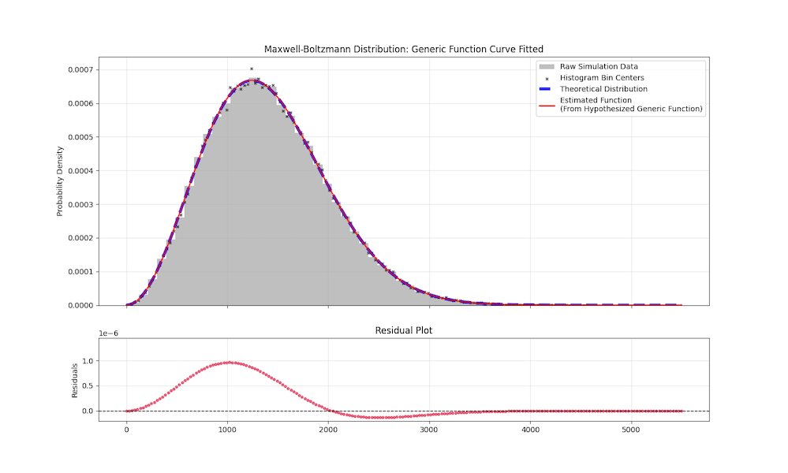
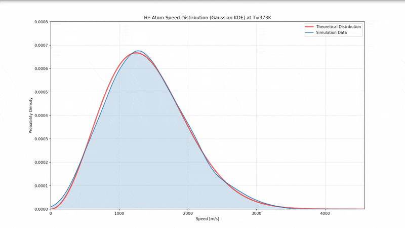
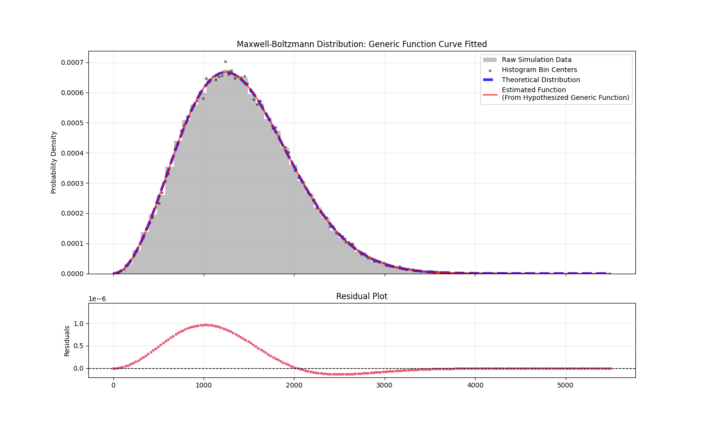

# Numerical Reconstruction of the Maxwell-Boltzmann Distribution via 3D Monatomic Hard-Sphere Simulation
This project explores the numerical reconstruction of the Maxwell-Boltzmann probability density function based on data generated from a 3D hard-sphere simulation system. Additionally, the study evaluates the accuracy of reconstruction by comparing cubic spline interpolation and standard non-linear curve fitting (`scipy.optimize`, Levenberg-Marquardt) against the theoretical curve.
<table>
  <tr>
    <td width="40%" align="center" valign="middle">
      
    </td>
    <td width="20%" align="center" valign="middle">
      
    </td>
    <td width="40%" align="center" valign="middle">
      
    </td>
  </tr>
</table>


## Table of Contents
1. [Project Overview](#numerical-reconstruction-of-the-maxwell-boltzmann-distribution-via-3D-monatomic-hard-sphere-simulation)
2. [Theoretical Background](#theoretical-background)
3. [Methodology](#methodology)
4. [Results](#results)
5. [Conclusion](#conclusion)
6. [Installation & Usage](#installation--usage)
7. [Acknowledgements & Resources](#acknowledgements--resources)
8. [AI Use Declaration](#ai-use-declaration)


## Theoretical Background

### The Maxwell-Boltzmann Distribution
For an ideal gas at thermodynamic equilibrium, the speeds of particles are not uniform. Instead, they follow a specific probability distribution known as *Maxwell-Boltzmann PDF*.

The probability density function $f(v)$ for a particle of mass $m$ at temperature $T$ is given by:

$$f(v)=4\pi \left( \frac{m}{2\pi k_B T} \right)^{3/2} v^2 \exp\left(-\frac{mv^2}{2k_B T}\right)$$

Conventional analytical approaches to derive the aforementioned function rely on frameworks from statistical mechanics or entropy maximization. The primary objective of this project is to numerically reconstruct the *Maxwell-Boltzmann probability density function (PDF)* from the data collected from a simulated 3D thermodynamic system using a hard-sphere particle model.

Beyond simple verification, this study aims to evaluate the accuracy of statistical reconstruction techniques. Specifically, *Cubic Spline Interpolation* against *Non-Linear Curve Fitting* (via `scipy.optimize`) to determine which method better reconstruct the theoretical distribution from discrete, stochastic simulation data.


## Methodology
This project consists of 2 phases: the Kinematic Simulation, which generate raw physical data, and the Numerical Reconstruction, which analyzes the statistical properties and implement *Cubic Spline Interpolation* and *Non-Linear Curve Fitting* of the system (`main.py`). Additionally, 3D particle simulation visualizer is also provided (`vis3D.py`)

### Physical Assumptions
I treat the system as an *Ideal Gas*. The require specific constraints on how particles behave:
1. **No Intermolecular Forces**: Particles do not attract or repel each other at a distance. They only interact when they physically collide (*Hard-Sphere Model*).
2. **Random Motion**: Particles move in straight lines in random directions until they collide with each other or the container wall.
3. **Elastic Collisions**: All collisions are perfectly elastic, no energy is lost to heat or deformation.
4. **Small Atomic Radius**: Particles posses very small atomic radius (matching the real size of an Element in nanometers).

Note: As the simulation needs to check for particle colliding, I can not assume of *Point Mass*.

### Simulation Environment
The simulation models an ideal gas within a bounded 3D cubic container of length $L$. The simulation is initialized with $N$ spherical particles, each having mass $m$ and radius $R$ at $T$ temperature in Kelvin. ($L$, $N$, $m$, $T$, and particle element can be modified in the `main.py` file.)
#### Initialization Conditions:
1. **Positions** ($\vec{r}$): Initialized uniformly apart from each other within the domain $(R, L -R)$ for all dimension $(x, y, z)$. Ensuring no two particles overlapping when spawned.
2. **Velocities** ($\vec{v}$): Initialized with random components in $(x, y, z)$ but root mean square ($v_{rms}$) of all particles are scaled to theoretical value. Directly correlate Temperature ($T$) with the simulation's environment (Assuming constant total kinetic energy).
3. **Discrete Time Steps** ($dt$): Set as $0.2$ factor of the time interval particle takes to move with displacement equals to its radius. Preventing unexpected particle tunnelling from excessive initial $dt$.

### Data Structure & Vectorization
The system states are represented using **NumPy $N$-dimension arrays**. All mathematical operations are represented as vectorized linear algebra operation as well.
1. **Position Matrix ($\mathbf{R}$)**: An $(N \times 3)$ array where the $i$-th row represents the coordinates of particle $i$.

$$
\mathbf{R}_{N \times 3} = 
\begin{bmatrix} 
\vdots & \vdots & \vdots \\
r_{i,x} & r_{i,y} & r_{i,z} \\
\vdots & \vdots & \vdots 
\end{bmatrix} 
$$

$$
\vec{r}_{i} = r_{i, x} \hat{i} + r_{i, y} \hat{j} + r_{i, z} \hat{k}
$$

2. **Velocity Matrix ($\mathbf{V}$)**: An $(N \times 3)$ array where the $i$-th row represents the velocity of particle $i$.

$$
\mathbf{V}_{N \times 3} = 
\begin{bmatrix} 
\vdots & \vdots & \vdots \\
v_{i,x} & v_{i,y} & v_{i,z} \\
\vdots & \vdots & \vdots 
\end{bmatrix} 
$$

$$
\vec{v}_{i} = v_{i, x} \hat{i} + v_{i, y} \hat{j} + v_{i, z} \hat{k}
$$

### Kinematics Simulation
The simulation evolves over discrete time steps $dt$. With each step $dt$, particle position are updated using Forward Euler integration:

$$\vec{r}(t+dt) = \vec{r}(t) + \vec{v}(t)dt$$

### Collision Handling Mechanisms
Collision observed in this simulation consists of 2 distinct type: *Wall-Particle Collisions* and *Particle-Particle Collisions*. The simulation handles these interaction differently.
#### Wall-particle Collisions
The container walls are treated as infinite mass barriers with perfect elasticity. If particle component $r_{i}$ reaches or exceeds the boundary limits $L$, the velocity component perpendicular to the wall will be inverted:

$$\vec{v}_{\perp, new} = -\vec{v}_{\perp, old}$$

#### Particle-Particle Collisions
At every step of evolving $dt$, the scripts checks for overlapping particle pairs. By finding Euclidean distance between each particles pair $i$, $j$ and check if they are below particle's diameter:

$$\lVert \vec{r}_{i}-\vec{r}_{j} \rVert \le 2R$$

Once the collision event is triggered, the velocities are updated based on the conservation of linear momentum and kinetic energy. For two particles of equal mass, the post-collision velocities are calculated using vector projection along the line of impact.
* Defining Collision Axis:

$$ \hat{c} = \frac{\vec{r}_1-\vec{r}_2}{\lVert \vec{r}_1-\vec{r}_2 \rVert} $$
* Decomposing Velocity Vector. Split $\vec{v}_i$ into two perpendicular components, one parallels to the collision axis, one perpendiculars. The perpendicular velocities will remain constant from Newton's Second Law:

$$ \vec{v}_i = \vec{v}_{i, \parallel} + \vec{v}_{i, \perp} $$
$$ \vec{v}_{i, \parallel} = (\vec{v}_i \cdot \hat{c})\hat{c} $$

* Applying 1D conservation laws of Energy and Momentum along the collision axis. As $m_1 = m_2$, the general solution is:

$$ \vec{v}_{1, \parallel, f} = \vec{v}_{2, \parallel, i} \\, and \\, \vec{v}_{2, \parallel, f} = \vec{v}_{1, \parallel, i} $$

* Reconstruct Final Velocity Vector:

$$ \vec{v}_{1, f} = \vec{v}_{1, \perp, i} + \vec{v}_{1, \parallel, f} $$
$$ \vec{v}_{1, f} = (\vec{v}_{1, i} - \vec{v}_{1, \parallel, i})+\vec{v}_{2, \parallel} $$
$$ \vec{v}_{1, f} = \vec{v}_{1, i} - (\vec{v}_{1, \parallel, i} - \vec{v}_{2, \parallel}) $$


* Substitute Unit Vectors:

$$ \vec{v}_{1, f} = \vec{v}_{1, i} - ((\vec{v}_{1, i} \cdot \hat{c})\hat{c} - (\vec{v}_{2, i} \cdot \hat{c})\hat{c}) $$
$$ \vec{v}_{1, f} = (\vec{v}_{1, i} - ((\vec{v}_{1, i} - \vec{v}_{2, i}) \cdot \hat{c})) \hat{c} $$

* Substitute $\hat{c}$ back, and repeat for $\vec{v}_{2, f}$:

$$\vec{v}_{1, f} = \vec{v}_{1, i} - \frac{(\vec{v}_{1, i}-\vec{v}_{2, i}) \cdot (\vec{r}_{1, i}-\vec{r}_{2, i})}{\lVert \vec{r}_{1, i}-\vec{r}_{2, i} \rVert^2} (\vec{r}_{1, i}-\vec{r}_{2, i})$$
$$\vec{v}_{2, f} = \vec{v}_{2, i} - \frac{(\vec{v}_{2, i}-\vec{v}_{1, i}) \cdot (\vec{r}_{2, i}-\vec{r}_{1, i})}{\lVert \vec{r}_{2, i}-\vec{r}_{1, i} \rVert^2} (\vec{r}_{2, i}-\vec{r}_{1, i})$$

The vector form of velocites ensures that the changes in momentum is directly and only applied along the normal vector connecting the particles pair center.

### Numerical Reconstruction
To reconstruct PDF, the simulation are run for a set amount of iterations until the system reaches its equilibrium and all transients are eliminated, then data are collected for set amount of samples. Later, all the data are stacked and combined into single large array, velocity magnitudes are then extracted and binned into a histogram. Two separate numerical Methods are then applied to this data set.
#### Method 1: Cubic Spline Interpolation
To reconstruct the PDF without assuming the underlying physical with gaussian distribution or any type of regressions, I utilize Cubic Spline interpolation. Using the histogram bin midpoints as data set of $(x_i, y_i)$, the algorithm constructs a piecewise function $S_{i}(x)$ for each interval $[x_{i}, x_{i+1}]$:

$$
S_{i}(x) = a_i + b_i (x-x_i) + c_i (x-x_i)^2 + d_i (x-x_i)^3
$$

$$
S(x) = 
\begin{cases} 
S_i(x) & x \in [x_i, x_{i+1}] \\
S_{i+1}(x) & x \in [x_{i+1}, x_{i+2}] \\
S_{i+2}(x) & x \in [x_{i+2}, x_{x+3}] \\
\vdots & \vdots \\
S_{n-1}(x) & x \in [x_{n-1}, x_n]
\end{cases}
$$


The coefficients ($a_i, b_i, c_i, d_i$) are determined by applying countinuity constraints for the function, its first and second derivative at every datapoints.

Additionally, due to a known limitation of polynomial interpolation method, including cubic spline, is **Unbounded Extrapolation**. While the spline accurately models the distribution within the sampled velocity range $[v_{min}, v_{max}]$, the polynomials inherently diverge towards $\pm \infty$ outside this domain. To counter against this issue, I resolve it by setting any prediction data outside the range of $[v_{min}, v_{max}]$ to 0 and remove any negative result probability.

#### Method 2: Non-Linear Curve Fitting (Levenberg-Marquardt)
By observation of the histogram, we could hypothesize the target model function $g(v, A, B)$ as:

$$
g(v) = Av^2exp(-Bv^2)
$$

Utilizing `scipy.optimize.curve.fit`, the library apply the *Levenberg-Marquardt Algorithm* to minimizes the sum of square residuals (SSR) between the model and the histogram datapoints to find the optimal parameters $A$ and $B$.

### Visualization and Output
#### Statistical Output (Utilizing `Matplotlib`)
The scripts provide 6 options for the statistical visualization
```text
[1] Visualizing Initial PDF Compared to Theoretical PDF
[2] Visualize Dynamic Simulated PDF Histogram
[3] Visualize Dynamic Simulated PDF (KDE curve)
[4] Visualize Estimated Function From Hypothesized Generic Function
[5] Visualize Histogram's Bin Midpoint Spline Interpolated Curve
```
Every mode of visualization provided theoretical reference curve.
* Option [1] plot the initial speed distribution PDF before the simulation starts
* Option [2] illustrate realtime speed distribution PDF as the system converges to equilibrium in Histogram
* Option [3] same as option [2] but represent in form of gaussian KDE estimated curve
* Option [4], [5] conclude the simulation and sampling with: Raw Data Point marked as (`x`), Velocity Histogram, Curve Fitting Overlay, Residual plots. Mean Squared Error (MSE), $A, B$ value and Percentage error for [4] are also outputed in the terminal.

#### Real-Time 3D Rendering (Utilizing `VPython`)
Each element in the position Array ($\mathbf{R}$) is mapped with spherical model at each step time interval $dt$. As time ($dt$) evoles, the postion of each molecule shifts along the calculation of the simulation.

Additionally, speed of each molecules is mapped into spectrum colors. With each color represent current speed of that element $\lVert v(t) \rVert$, ranging from highest $v_{min}$ to $v_{max}$, red to violet.


## Results

### Quantitative Accuracy
The accuracy of the simulation is evidenced by the negligibly low error margin observed across 10,000 sampling iterations. Provided with several numerical key metrics:
* **Max Residual Error:**
  * Cubic Spline Interpolation: $< 2.5 \times 10^{-6}$
  * Non-Linear Curve Fitting: $< 1 \times 10^{-6}$
* **Mean Squared Error (Mse):**
  * Cubic Spline Interpolation:: $1.29 \times 10^{-11}$
  * Non-Linear Curve Fitting: $1.38 \times 10^{-13}$
* **Parameter Accuracy (Curve Fit):**
  * Parameter A Percentage Error: $0.207 %$
  * Parameter B Percentage Error: $0.078 %$

### Visual Analysis
#### Initial Speed Distribution immediatly after spawning particles:
It is noticeable that the initial distribution generated from *Mersenne Twister* has no correlation with the theoretical distribution at all.
<div align = "center">
<table>
  <tr>
    <td align="center">
      
    </td>
  </tr>
</table>
</div>

#### Realtime Speed Distribution:
Both visualization closely capture the characteristics of the theoretical distribution, with only minor fluctuations arising from limited sample sizes and the use of an inappropriate Gaussian KDE regression.
<table>
  <tr>
    <td width="50%" align="center" valign="middle">
      
      <br />
      <a href="https://youtu.be/24GUUjp-Bbw">Better Quality Video</a>
    </td>
    <td width="50%" align="center" valign="middle">
      
      <br />
      <a href="https://youtu.be/ZUTJYeyOlvI">Better Quality Video</a>
    </td>
  </tr>
</table>

#### Finalized Reconstructed PDF:
Notable detail worth mentioning in addition to the quantitative accuracy part:
* Cubic Spline Residuals exhibiting tiny cone shape sinuiodal oscillation: This is most likely cause by approximating a transcendental function of exponential decay with piecewise polynomial, utlizing inappropriate interpolation method, regression model is the cause of this problem. It is also important to note that the max residual error is less than $2.5 \times 10^{-6}$
* Curve Fitting Residuals' Systematic Drift: The residual plot for the Levenberg-Marquardt curve fit does not display random scatter but a noticeable pattern corresponds to the difference between two Maxwell-Boltzmann PDF with infinitesimally different temperature parameters, this is most likely due to finite bin width limitations rather than the physical inaccuracy in the simulation.
<table>
  <tr>
    <td width="50%" align="center" valign="middle">
      
    </td>
    <td width="50%" align="center" valign="middle">
      
    </td>
  </tr>
</table>

#### Dynamic 3D Simulation Visualization of particles:
<div align = "center">
<table>
  <tr>
    <td align="center">
      
      <br />
      <a href="https://youtu.be/AB35dECbc-U">Better Quality Video</a>
    </td>
  </tr>
</table>
</div>


## Conclusion
The hard-sphere simulation **successfully** reconstructed the Maxwell–Boltzmann distribution using both cubic spline interpolation and nonlinear curve fitting (Levenberg–Marquardt), with negligible error relative to the theoretical distribution. By bridging three-dimensional dynamic hard-sphere simulations with statistical analysis, the model demonstrates how thermodynamic equilibrium spontaneously emerges from chaotic, perfectly elastic collisions. This simulation therefore serves as a computational proof of concept for the statistical mechanics underlying the ideal gas law.


## Installation & Usage

### 1. Prerequisites & Setup
First, ensure you have Python 3.x installed. For Window OS replace `python3` with `python`.

Clone repository:
```sh
git clone https://github.com/youMetTem/NumericalMBPDFreconSimulation.git
cd NumericalMBPDFreconSimulation
```
Install requirements:
```sh
python3 -m venv env
. env/bin/activate
pip install -r requirements.txt
```

### 2. Running the Simulation and Analysis (`main.py`)
By default, the simulation models 2000 Helium molecules at a temperature of 373 K confined within a cubic box of side length $10^{-9}\\,\text{m}$. These parameters can be modified in the `main.py` file.

Run the script:
```sh
python3 src/main.py
```

An interactive menu will appear in your terminal. Select a mode by typing the corresponding number to view visualization of the analysis.
The following is an example of the output:
```text
$ python3 src/main.py

=====Helium Molecules Simulation=====
------------------------------------------
Please Select Mode of Computation
------------------------------------------
[1] Visualizing Initial PDF Compared to Theoretical PDF
[2] Visualize Dynamic Simulated PDF Histogram
[3] Visualize Dynamic Simulated PDF (KDE curve)
[4] Visualize Estimated Function From Hypothesized Generic Function
[5] Visualize Histogram's Bin Midpoint Spline Interpolated Curve
[6] Exit
<*> Default mode is set to Helium, change this in main.py, parameters block
<*> Mode [4], [5] might take a few second
------------------------------------------
Selected Mode: 
```
After selecting a mode, wait a few seconds for the Matplotlib visualization window will appear after a brief delay. Once you are satisfied with viewing the graphs, close the window to select another mode within the same simulation batch. To exit the program, enter `6`

### 3. Running the 3D Simulation Visualization (`vis3D.py`)
The script lauches a real-time hard-sphere particle simulation of particles colliding within a box of fixed dimensions using `VPython`.

Run the script:
```bash
python3 src/vis3D.py
```

A local web server will start, and your default web browser will automatically open a new tab to display the 3D animation.

#### 3D Simulation Controls (MacOS/Trackpad)
Once the browser window opens, you can navigate the 3D space using these trackpad gestures:

| Action | Trackpad Gesture | Keyboard Alternative |
| :--- | :--- | :--- |
| **Rotate View** | **Two-finger Click** & Drag | Hold **Ctrl** + Click & Drag |
| **Zoom In/Out** | **Two-finger Swipe** (Up/Down) | Hold **Option (Alt)** + Click & Drag |
| **Pan (Move)** | Hold **Shift** + Click & Drag | -- |

Note: For more details on camera control, refer to the official [VPython Documentation](https://www.glowscript.org/docs/VPythonDocs/index.html#).


## Acknowledgements & Resources
This project was inspired by serveral excellent resources. Special thanks to the following creators, authors for their high quality educational content:
* **Physics for Scientists and Engineers (Serway & Jewett)** - Primary reference for the Kinetic Theory of Gases and Maxwell-Boltzmann derivation.
* **[Numerical Methods for Engineers](https://youtube.com/playlist?list=PLkZjai-2Jcxn35XnijUtqqEg0Wi5Sn8ab&si=NUFmcl7sFmRZM9Wr)** by *Prof. Jeffrey Chasnov* - Provided the concept of numerical matrix operation and cubic spline interpolation.
* **[EGME206 Numerical Methods for Engineers, Spring 2021](https://youtube.com/playlist?list=PLLM1AZpDbYI1HPhHWmA-_5YqF26Rnt9ZM&si=xaMQ15EgJC063XTu)** by *Prof. Ittichote Chuckpaiwong* - In-dept explanation in the topic of Regressions.
* **[VPython for Beginners](https://youtube.com/playlist?list=PLdCdV2GBGyXOnMaPS1BgO7IOU_00ApuMo&si=8MC25WVnnu3wRcem)** by *Let's Code Physics* - Introduce the usage of `VPython` for 3D simulation.


## AI Use Declaration
This project utilized AI tools to assits in the development process and text refinement.
* **GitHub Copilot:** Used for code autocompletion, debugging scripts, and snipped generation.
* **Google Gemini:** Used for mundane snipped code generation, drafting the initial structure of this README file, text refinement, and documentation formatting.

All scientific logics, mathematical derivations, and final code implementation were verified and reviewed by me.
